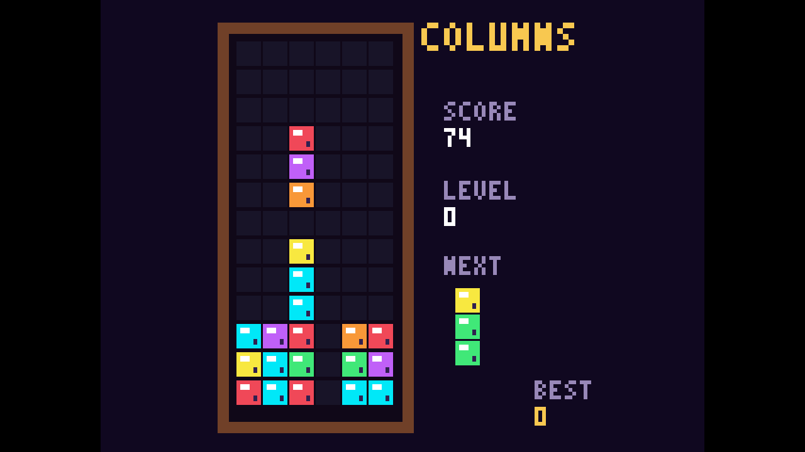

# Columns WAT

Columns WAT is a complete falling-triplet jewel game written directly in
WebAssembly text format. Its layout draws from the arcade and Genesis Columns
playfield, rendered as crisp pixel art in a true 1280×720 framebuffer.

## Play it now:
```
npx wasmcart https://raw.githubusercontent.com/wasmcart/columns-wat/main/columns-wat.wasc
```



## Build, run, and test

```sh
./build.sh
npx wasmcart ./columns-wat.wasc
node test.mjs
```

The build script uses WABT through `npx` to compile `game.wat` into
`game.wasm`, then packages the module as `columns-wat.wasc`.

## Controls

| Action | Controller | Keyboard |
| --- | --- | --- |
| Move | D-pad Left/Right | Left/Right or A/D |
| Soft drop | D-pad Down | Down or S |
| Cycle jewels forward | A or D-pad Up | X, Space, Up, or W |
| Cycle jewels backward | B, X, or Y | Z |
| Pause | Start | Enter |
| Restart after game over | A | X or Space |

Down accelerates normal descent. No face button instantly drops or locks a
triplet.

## Gameplay

Horizontal, vertical, and both diagonal runs of three or more jewels clear.
Falling jewels collapse after a clear, and resulting cascades increase the
chain multiplier. The game includes a next-triplet preview, score, level,
chain display, increasing speed, and persistent best-score storage.

The atmospheric original stereo soundtrack combines modal lead, bass, and
glassy arpeggio voices. Jewel cycling, matches, chains, pausing, and game-over
states have independent sound effects.

The test suite validates the wasmcart ABI, 1280×720 output, forward and reverse
jewel cycling, face-button behavior, accelerated Down input, movement,
horizontal match resolution, and stereo audio output.
